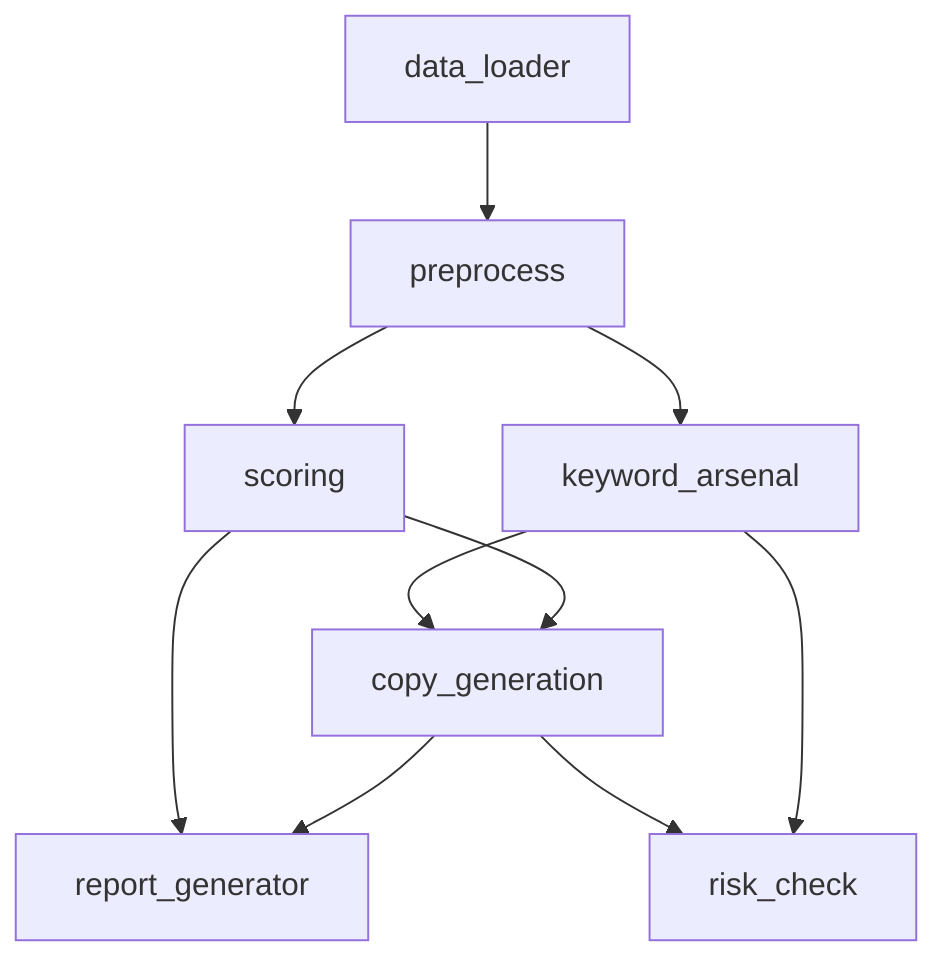

# modules/ INDEX

## 目的
存放核心业务逻辑模块，实现Amazon Listing Skill的主要功能。

## 内容结构
```
modules/
├── INDEX.md (此文件)
├── capability_check.py     # 能力检查
├── canonical_facts.py      # 产品事实标准化与 claim permission
├── claim_language_contract.py # 合规语言审计与语义修复
├── copy_generation.py      # 文案生成
├── field_provenance.py     # 字段来源等级与 launch eligibility
├── intent_translator.py    # 意图翻译
├── keyword_arsenal.py      # 关键词库
├── keyword_reconciliation.py # final text 关键词复核
├── keyword_protocol.py     # 关键词质量、机会评分与流量分层协议
├── keyword_utils.py        # 关键词工具
├── language_utils.py       # 语言工具
├── listing_candidate.py    # Listing 候选对象契约归一化
├── packet_rerender.py      # slot 级结构化 rerender 计划与替换
├── readiness_verdict.py    # 单一 operational readiness 决策
├── run_supervisor.py       # 多版本运行监督器与 worker 隔离
├── run_worker.py           # 单 worker 运行封装与状态文件契约
├── report_generator.py     # 报告生成
├── risk_check.py           # 风险检查
├── slot_contracts.py       # bullet slot 语义合同
├── scoring.py              # 评分算法
├── visual_audit.py         # 视觉审核
└── writing_policy.py       # 写作策略
```

## 模块说明
| 模块 | 说明 | 大小 | 最后更新 |
|------|------|------|----------|
| capability_check.py | 检查系统能力和配置 | 中 | 2026-04-03 |
| canonical_facts.py | 产品事实标准化、claim permission 与 fact readiness | 小 | 2026-04-29 |
| claim_language_contract.py | 合规语言合同、违规表面词审计与语义修复 | 小 | 2026-04-29 |
| copy_generation.py | 生成Amazon列表文案 | 大 | 2026-04-03 |
| field_provenance.py | 字段来源等级、fallback 语义与 launch eligibility | 小 | 2026-04-29 |
| intent_translator.py | 翻译用户意图到文案要求 | 中 | 2026-04-03 |
| keyword_arsenal.py | 管理和优化关键词库 | 大 | 2026-04-03 |
| keyword_reconciliation.py | 扫描最终候选文案并按权威 metadata 复核关键词覆盖 | 小 | 2026-04-29 |
| keyword_protocol.py | 关键词质量过滤、蓝海机会评分、相对 L1/L2/L3 分层与路由协议 | 中 | 2026-04-28 |
| keyword_utils.py | 关键词处理工具函数 | 中 | 2026-04-03 |
| language_utils.py | 语言处理工具函数 | 中 | 2026-04-03 |
| listing_candidate.py | Listing 候选对象契约归一化、reviewable 与 paste-ready 状态判定 | 小 | 2026-04-29 |
| packet_rerender.py | slot 级结构化 rerender 计划与替换 helper | 中 | 2026-04-25 |
| readiness_verdict.py | 对 version_a/version_b/hybrid 候选做 paste-ready 排名并输出唯一运营决策 | 小 | 2026-04-29 |
| run_supervisor.py | 双版本/多 worker 运行监督、超时隔离与 summary 汇总 | 中 | 2026-04-27 |
| run_worker.py | 单 worker 运行包装、状态文件与失败摘要 | 中 | 2026-04-27 |
| report_generator.py | 生成各种报告 | 中 | 2026-04-03 |
| risk_check.py | 检查文案风险 | 中 | 2026-04-03 |
| slot_contracts.py | bullet slot 责任、header/body 同源语义与修复 payload | 小 | 2026-04-29 |
| scoring.py | 评分算法和规则 | 大 | 2026-04-03 |
| visual_audit.py | 视觉内容审核 | 中 | 2026-04-03 |
| writing_policy.py | 写作策略和规范 | 大 | 2026-04-03 |

## 模块依赖


## 使用指南
1. 新功能模块添加到此目录
2. 模块之间保持松耦合
3. 使用清晰的接口定义
4. 添加单元测试到 `tests/unit/`

## 相关链接
- [tools/](../tools/): 工具函数目录
- [tests/](../tests/): 测试文件目录
- [main.py](../main.py): 主程序入口

## 最后更新
2026-04-29: 新增 canonical_facts.py、claim_language_contract.py、field_provenance.py、slot_contracts.py 合同层索引
2026-04-29: 新增 readiness_verdict.py operational readiness 决策索引
2026-04-29: 新增 keyword_reconciliation.py 最终文案关键词复核索引
2026-04-29: 新增 listing_candidate.py 候选对象契约索引
2026-04-28: 新增 keyword_protocol.py 关键词协议核心索引
2026-04-27: 新增 run_supervisor.py 与 run_worker.py 索引
2026-04-25: 新增 packet_rerender.py 索引
2026-04-03: 初始创建
