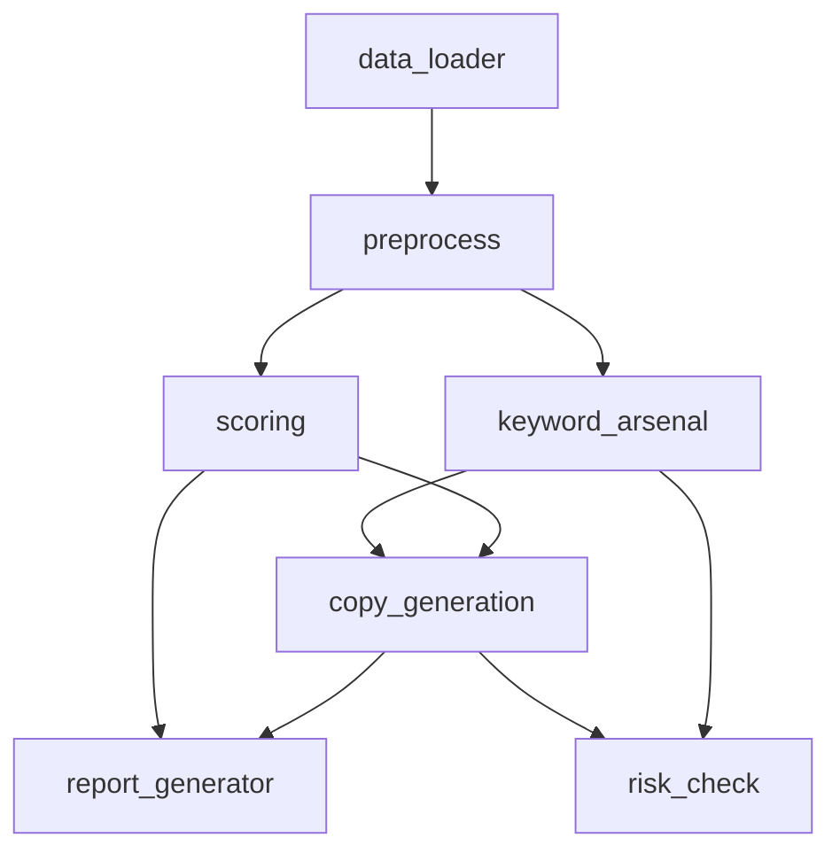

# modules/ INDEX

## 目的
存放核心业务逻辑模块，实现Amazon Listing Skill的主要功能。

## 内容结构
```
modules/
├── INDEX.md (此文件)
├── capability_check.py     # 能力检查
├── copy_generation.py      # 文案生成
├── intent_translator.py    # 意图翻译
├── keyword_arsenal.py      # 关键词库
├── keyword_utils.py        # 关键词工具
├── language_utils.py       # 语言工具
├── report_generator.py     # 报告生成
├── risk_check.py           # 风险检查
├── scoring.py              # 评分算法
├── visual_audit.py         # 视觉审核
└── writing_policy.py       # 写作策略
```

## 模块说明
| 模块 | 说明 | 大小 | 最后更新 |
|------|------|------|----------|
| capability_check.py | 检查系统能力和配置 | 中 | 2026-04-03 |
| copy_generation.py | 生成Amazon列表文案 | 大 | 2026-04-03 |
| intent_translator.py | 翻译用户意图到文案要求 | 中 | 2026-04-03 |
| keyword_arsenal.py | 管理和优化关键词库 | 大 | 2026-04-03 |
| keyword_utils.py | 关键词处理工具函数 | 中 | 2026-04-03 |
| language_utils.py | 语言处理工具函数 | 中 | 2026-04-03 |
| report_generator.py | 生成各种报告 | 中 | 2026-04-03 |
| risk_check.py | 检查文案风险 | 中 | 2026-04-03 |
| scoring.py | 评分算法和规则 | 大 | 2026-04-03 |
| visual_audit.py | 视觉内容审核 | 中 | 2026-04-03 |
| writing_policy.py | 写作策略和规范 | 大 | 2026-04-03 |

## 模块依赖


## 使用指南
1. 新功能模块添加到此目录
2. 模块之间保持松耦合
3. 使用清晰的接口定义
4. 添加单元测试到 `tests/unit/`

## 相关链接
- [tools/](../tools/): 工具函数目录
- [tests/](../tests/): 测试文件目录
- [main.py](../main.py): 主程序入口

## 最后更新
2026-04-03: 初始创建